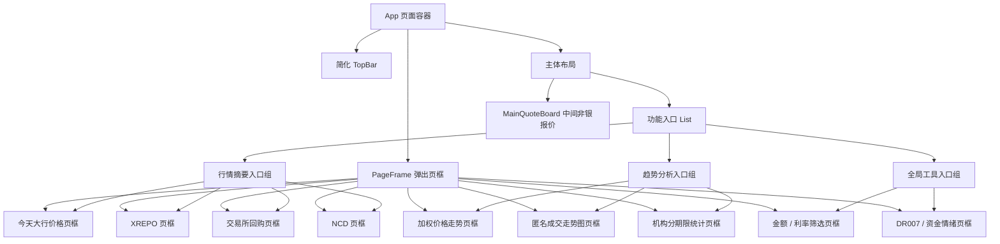

# 资金实时行情看板 收缩入口版线框图

## 1. 改版目标

保留中间 `MainQuoteBoard / 非银报价` 作为页面主工作区，其余内容不再常驻占用左右两侧空间，统一收缩为一个「功能入口 List」。

用户点击 List 中的入口后，弹出对应的网页页框，页框内承载原来的模块内容，例如：今天大行价格、XREPO、交易所回购、NCD、加权价格走势、匿名成交走势图、机构分期限统计等。

## 2. 改版后页面总览

```text
+------------------------------------------------------------------------------------------------+
| 资金实时行情看板                                                        [入口列表] [布局] [状态] |
+----------------------+-------------------------------------------------------------------------+
| 功能入口 List         | 中间主工作区：非银报价                                                     |
|                      |                                                                         |
| 搜索入口 [________]   | +---------------------------------------------------------------------+ |
|                      | | 非银报价                                                            | |
| 行情摘要              | | 期限: [全部] [R001] [R007] [R014] [R021] [R028]                      | |
| > 今天大行价格        | | 层级: [1级] [2级]                                      [下载]        | |
| > XREPO              | +---------------------------------------------------------------------+ |
| > 交易所回购          | |                                                                     | |
| > NCD                | | 报价分组列表                                                         | |
|                      | |                                                                     | |
| 趋势分析              | | +---------------------------- 利率地方 ----------------------------+ | |
| > 加权价格走势        | | | 机构 | 期限 | 等级 | 金额 | 利率 | 账户类型 | 质押品 | 更新时间 | | |
| > 匿名成交走势图      | | | ...                                                             | | |
| > 机构分期限统计      | | +-----------------------------------------------------------------+ | |
|                      | |                                                                     | |
| 全局工具              | | +---------------------------- 存单商金 ----------------------------+ | |
| > 金额/利率筛选       | | | ...                                                             | | |
| > DR007/资金情绪      | | +-----------------------------------------------------------------+ | |
|                      | |                                                                     | |
|                      | | +------------------------------ 信用 ------------------------------+ | |
|                      | | | ...                                                             | | |
|                      | | +-----------------------------------------------------------------+ | |
|                      | |                                                                     | |
|                      | +---------------------------------------------------------------------+ |
+----------------------+-------------------------------------------------------------------------+
```

说明：

- 页面由「窄入口栏 + 中间主报价区」组成。
- 原左侧卡片和右侧图表全部从常驻布局中移除。
- 中间报价区获得更多横向空间，作为交易员主操作区。
- 入口 List 可以固定在左侧，也可以在窄屏下变成抽屉。

## 3. 入口 List 线框

```text
+------------------------------+
| 功能入口                      |
+------------------------------+
| 搜索 [ 输入模块名称 / 品种 ]   |
+------------------------------+
| 行情摘要                      |
|  1  今天大行价格     10:53:27 |
|  2  XREPO           R001/R007 |
|  3  交易所回购       核心     |
|  4  NCD             一级趋势  |
+------------------------------+
| 趋势分析                      |
|  5  加权价格走势     R001     |
|  6  匿名成交走势图   R001     |
|  7  机构分期限统计   R001     |
+------------------------------+
| 全局工具                      |
|  8  金额 / 利率筛选           |
|  9  DR007 / 资金情绪          |
+------------------------------+
```

入口状态：

```text
默认态      深色底 + 弱描边
hover       描边变亮，右侧出现箭头
打开中      蓝色高亮，显示当前页框已打开
有更新      入口右侧显示时间或小圆点
不可用      降低透明度，hover 显示原因
```

## 4. 点击入口后的网页页框

```text
遮罩层
+--------------------------------------------------------------------------------------+
| 网页页框 Header                                                                         |
| 今天大行价格                                      [刷新] [下载] [独立打开] [关闭]       |
+--------------------------------------------------------------------------------------+
| 面包屑: 行情摘要 / 今天大行价格                                                        |
+--------------------------------------------------------------------------------------+
|                                                                                      |
|  iframe-like 内容区 / PageFrame                                                        |
|                                                                                      |
|  +--------------------------------------------------------------------------------+  |
|  | 原模块内容                                                                       |  |
|  |                                                                                |  |
|  | 例如：今天大行价格表格                                                           |  |
|  | 机构       | 期限 | 非银利率 | 涨跌 | 银行利率 | 涨跌 | 更新时间                  |  |
|  | 工商银行   | 隔夜 | 1.95%   | -1   | 2.00%   | -2   | 10:53:27                 |  |
|  | ...                                                                            |  |
|  |                                                                                |  |
|  +--------------------------------------------------------------------------------+  |
|                                                                                      |
+--------------------------------------------------------------------------------------+
```

页框规则：

- 点击入口后打开一个居中的网页页框。
- 页框大小建议为 `80vw x 82vh`，最大宽度 `1440px`。
- 页框内保留原模块的筛选、tab、图表、表格、tooltip。
- 页面主报价区不卸载，关闭页框后回到原操作状态。
- 同一时间默认只打开一个页框，点击另一个入口时替换页框内容。

## 5. 入口与页框内容映射

| List 入口 | 弹出页框标题 | 页框内容 | 来源模块 |
|---|---|---|---|
| 今天大行价格 | 今天大行价格 | 大行价格表、手工输入、下载 | `LeftSummaryPanel` / `BankRateEditorModal` |
| XREPO | XREPO | XREPO 表格、发送、下载 | `leftSections` / `StructuredTable` |
| 交易所回购 | 交易所回购 | 核心 / 上交所 / 深交所 tab 表格 | `ExchangeRepoCard` |
| NCD | NCD | 一级 / 二级、趋势图 / 表格、展开图表 | `LeftNcdCard` |
| 加权价格走势 | 加权价格走势 | 时间范围、对比品种、折线和成交量 | `HistoryClosePanel` |
| 匿名成交走势图 | 匿名成交走势图 | 叠加品种、日内折线、tooltip | `IntradayPanel` |
| 机构分期限统计 | 机构分期限统计 | 期限、指标、机构图例、多线图 | `CfetsInstPanel` |
| 金额 / 利率筛选 | 全局筛选 | 金额区间、利率区间、筛选确认 | `TopBar` 筛选区 |
| DR007 / 资金情绪 | 市场状态 | DR007、资金情绪、情绪趋势浮层 | `TopBar` / `SentimentChipWithPopover` |

## 6. 新版结构关系



## 7. 典型交互流程


## 8. 各页框线框

### 8.1 加权价格走势页框

```text
+--------------------------------------------------------------------------------+
| 加权价格走势                                             [刷新] [下载] [关闭]    |
+--------------------------------------------------------------------------------+
| 产品: R001       对比: [不对比 v]        时间: [近5日] [近1M] [近半年]           |
+--------------------------------------------------------------------------------+
|                                                                                |
|                         折线图 + hover tooltip                                  |
|                                                                                |
|                         成交量柱状图 / 利差柱状图                               |
|                                                                                |
+--------------------------------------------------------------------------------+
```

### 8.2 匿名成交走势图页框

```text
+--------------------------------------------------------------------------------+
| 匿名成交走势图                                           [刷新] [下载] [关闭]    |
+--------------------------------------------------------------------------------+
| 品种: R001          叠加品种: [不叠加 v]                                        |
+--------------------------------------------------------------------------------+
|                                                                                |
|                         日内折线图                                              |
|                         橙色参考线                                              |
|                         hover tooltip                                           |
|                                                                                |
+--------------------------------------------------------------------------------+
```

### 8.3 机构分期限统计页框

```text
+--------------------------------------------------------------------------------+
| 机构分期限统计                                           [刷新] [下载] [关闭]    |
+--------------------------------------------------------------------------------+
| 期限: [R001] [R007] [R014] [R021] [R1M] [R2M] [R3M] ... [R1Y]                   |
| 指标: [正回购利率] [逆回购利率] [正回购金额] [逆回购金额] [机构资金结构] ...       |
| 图例: 大行 股份行 理财 理财子 券商 基金 保险                                    |
+--------------------------------------------------------------------------------+
|                                                                                |
|                         多机构趋势图                                            |
|                                                                                |
+--------------------------------------------------------------------------------+
```

### 8.4 左侧行情摘要页框

```text
+--------------------------------------------------------------------------------+
| 今天大行价格 / XREPO / 交易所回购 / NCD                    [刷新] [下载] [关闭] |
+--------------------------------------------------------------------------------+
| 页框内保留原模块自己的 tab、按钮、表格、图表                                    |
|                                                                                |
|                         原卡片内容放大展示                                      |
|                                                                                |
+--------------------------------------------------------------------------------+
```

## 9. 改版前后布局差异

| 项目 | 改版前 | 改版后 |
|---|---|---|
| 左侧行情摘要 | 常驻左栏 | 收缩为 List 入口 |
| 右侧趋势分析 | 常驻右栏 | 收缩为 List 入口 |
| 中间非银报价 | 三栏中间，占 47% 左右 | 主工作区，占页面大部分宽度 |
| 模块查看方式 | 多卡片同时可见 | 主报价常驻，其他内容按需弹出 |
| 页面密度 | 信息密度高，但视觉拥挤 | 主操作更聚焦，辅助信息按需查看 |
| 弹窗 / 页框 | 仅部分功能有弹窗 | 所有非主内容统一 PageFrame 容器 |

## 10. 实现建议

1. 新增 `activeFrame` 状态，记录当前打开的入口。
2. 新增 `ModuleEntryList`，承载所有非中间模块入口。
3. 新增 `PageFrame`，统一处理标题、关闭、刷新、下载、独立打开等页框操作。
4. 将原 `LeftSummaryPanel` 和 `RightSidebar` 中的模块拆成可独立渲染的内容组件。
5. 中间 `MainQuoteBoard` 不变，继续作为页面主操作区。
6. 如果某个入口当前没有真实下载或发送逻辑，页框内按钮应禁用或给出明确提示。

