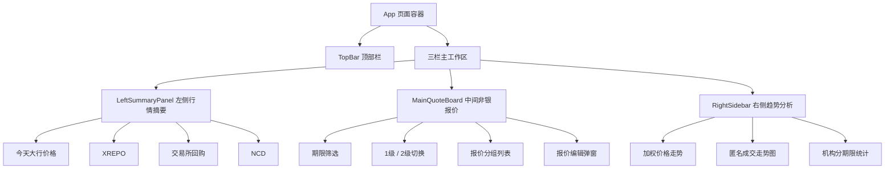

# 资金实时行情看板 页面线框图

> 对应当前主入口：`src/main.tsx` -> `src/app/App.tsx`

## 1. 页面总览线框

```text
+----------------------------------------------------------------------------------------------+
| TopBar                                                                                        |
| 页面标题: 资金实时行情看板        金额筛选: [0] ~ [不限] 亿    利率筛选: [0.00] ~ [不限] %     |
|                                                          DR007 [2.15%]  资金情绪  状态[平衡] |
+-------------------------+--+------------------------------------------------+--+-------------+
| LeftSummaryPanel        |  | MainQuoteBoard                                 |  | RightSidebar |
|                         |  |                                                |  |              |
| +---------------------+ |  | +--------------------------------------------+ |  | +----------+ |
| | 今天大行价格        | |  | | 非银报价                                   | |  | | 加权价格 | |
| | [手工输入] [下载]   | |  | | 期限: 全部 R001 R007 R014 R021 R028        | |  | | 走势     | |
| | 机构/期限/利率表    | |  | | 层级: 1级 / 2级      [下载]                | |  | |          | |
| +---------------------+ |  | |                                            | |  | +----------+ |
|                         |  | | 分组报价区                                  | |  |              |
| +---------------------+ |  | | - 利率地方                                  | |  | +----------+ |
| | XREPO               | |  | | - 存单商金                                  | |  | | 匿名成交 | |
| | [下载]              | |  | | - 信用                                      | |  | | 走势图   | |
| | R001/R007/...       | |  | |                                            | |  | +----------+ |
| | 每行 [发送]         | |  | | 行点击: 打开报价编辑弹窗                    | |  |              |
| +---------------------+ |  | +--------------------------------------------+ |  | +----------+ |
|                         |  |                                                |  | | 机构分期 | |
| +---------------------+ |  |                                                |  | | 限统计   | |
| | 交易所回购          | |  |                                                |  | +----------+ |
| | 核心 / 上交所 / 深交所 |  |                                                |  |              |
| +---------------------+ |  |                                                |  |              |
|                         |  |                                                |  |              |
| +---------------------+ |  |                                                |  |              |
| | NCD                 | |  |                                                |  |              |
| | 一级/二级 趋势图/表格 |  |                                                |  |              |
| +---------------------+ |  |                                                |  |              |
+-------------------------+--+------------------------------------------------+--+-------------+
                 ^                             ^                                ^
                 |                             |                                |
            左右栏可拖拽                 主报价工作区                    右侧趋势分析区
```

## 2. 页面结构关系



## 3. 顶部栏线框

```text
+----------------------------------------------------------------------------------------------+
| 资金实时行情看板  [布局]                                                                       |
|                                      金额 [ 0 ] ~ [ 不限 ] 亿   |   利率 [ 0.00 ] ~ [ 不限 ] % |
|                                                                 DR007 2.15% | 资金情绪 | 平衡 |
+----------------------------------------------------------------------------------------------+
```

交互说明：

- `[布局]`：恢复三栏默认宽度。
- 金额和利率字段：当前项目中是展示态，还没有真实输入和筛选逻辑。
- `资金情绪`：hover 后显示情绪浮层。

## 4. 左侧行情摘要线框

```text
+------------------------------------------------+
| 今天大行价格                         [手工输入] [下载] |
+------------------------------------------------+
| 机构       | 期限 | 非银利率 | 涨跌 | 银行利率 | 涨跌 | 更新时间 |
| 工商银行   | 隔夜 | 1.95%   | -1   | 2.00%   | -2   | 10:53:27 |
| 工商银行   | 7天  | 2.05%   | +1   | 2.10%   | -2   | 10:53:27 |
| ...                                                                    |
+------------------------------------------------+

+------------------------------------------------+
| XREPO                                      [下载] |
+------------------------------------------------+
| 期限 | 可点击量 | 正回购金额 | 正回购利率 | 逆回购利率 | 逆回购金额 | 可点击量 | 操作 |
| R001 | (4)     | 442亿     | 2.00%     | 1.95%     | 442亿     | (12)    | 发送 |
| R007 | (4)     | 28亿      | 2.00%     | 1.25%     | 442亿     | (12)    | 发送 |
+------------------------------------------------+

+------------------------------------------------+
| 交易所回购                   [核心] [上交所] [深交所] [下载] |
+------------------------------------------------+
| 期限 | 品种  | 最新   | 涨跌bp |
| 1天  | GC001 | 1.3700 | -1.00  |
| 7天  | GC007 | 1.3750 | -1.00  |
+------------------------------------------------+

+------------------------------------------------+
| NCD                         [一级] [二级] [趋势图] [表格] [展开] |
+------------------------------------------------+
| 图例: 国有/股份制  AAA  AA+  AA                                      |
|                                                                    |
|                    NCD 折线图 / 表格区域                           |
|                                                                    |
| 时间: [14D] [1M] [3M] [6M]                                          |
+------------------------------------------------+
```

## 5. 中间报价板线框

```text
+--------------------------------------------------------------------------------+
| 非银报价                                                                         |
| 期限: [全部] [R001] [R007] [R014] [R021] [R028]        [1级] [2级] [下载]        |
+--------------------------------------------------------------------------------+
|                                                                                |
| +------------------------------ 利率地方 -------------------------------------+ |
| | 机构       | 期限 | 等级 | 金额 | 利率 | 账户类型 | 质押品 | 起投门槛 | 更新时间 | |
| | XX机构     | R001 | 最优 | 5亿  | 1.40 | 自营     | 利率   | 5亿起    | 10:53  | |
| | 点击行 -> 打开报价编辑弹窗                                                    | |
| +----------------------------------------------------------------------------+ |
|                                                                                |
| +------------------------------ 存单商金 -------------------------------------+ |
| | ...                                                                          | |
| +----------------------------------------------------------------------------+ |
|                                                                                |
| +-------------------------------- 信用 ---------------------------------------+ |
| | ...                                                                          | |
| +----------------------------------------------------------------------------+ |
|                                                                                |
+--------------------------------------------------------------------------------+
```

二级模式下：

```text
+--------------------------------------------------------------------------------+
| 上半报价区                                                                       |
+--------------------------------------------------------------------------------+
|                      可拖拽横向分割条                                           |
+--------------------------------------------------------------------------------+
| 下半报价区                                                                       |
+--------------------------------------------------------------------------------+
```

报价编辑弹窗：

```text
+----------------------------------------------+
| 修改报价                                [关闭] |
+----------------------------------------------+
| 分组       [                    ]             |
| 机构       [                    ]             |
| 期限       [                    ]             |
| 利率       [                    ]             |
| 金额       [                    ]             |
| 起投门槛   [                    ]             |
| 账户类型   [                    ]             |
| 质押品     [                    ]             |
| 评级       [ 最优 / 次优 / 报价 ]              |
+----------------------------------------------+
|                                  [取消] [保存] |
+----------------------------------------------+
```

## 6. 右侧趋势分析线框

```text
+--------------------------------------------------------------+
| 加权价格走势    产品: R001   对比 [不对比 v]     [近5日] [近1M] [近半年] |
+--------------------------------------------------------------+
| y轴                                                               图例 |
| 1.394  - - - - - - - - - - - - - - - - - - - - - - - - - - 加权价格 |
|                                                                    |
|                       折线图                                       |
|                                                                    |
| 0.657  - - - - - - - - - - - - - - - - - - - - - - - - - -         |
|                                                                    |
| 成交量柱状图                                                        |
| 5/4              5/5              5/6              5/7       5/8    |
+--------------------------------------------------------------+

+--------------------------------------------------------------+
| 匿名成交走势图       R001        叠加品种 [不叠加 v]                 |
+--------------------------------------------------------------+
| y轴                                                               图例 |
|                                                                    |
|                       日内折线图                                   |
|                                                                    |
|                  橙色参考线 / 均线                                 |
|                                                                    |
| 09:30        10:00        11:00        14:00        15:00           |
+--------------------------------------------------------------+

+--------------------------------------------------------------+
| [机构分期限统计]                                                   |
+--------------------------------------------------------------+
| 期限: [R001] [R007] [R014] [R021] [R1M] [R2M] [R3M] ... [R1Y]       |
| 指标: [正回购利率] [逆回购利率] [正回购金额] [逆回购金额] ...        |
| 图例: 大行 股份行 理财 理财子 券商 基金 保险                       |
|                                                                    |
|                       多机构折线图                                 |
|                                                                    |
+--------------------------------------------------------------+
```

## 7. 主要交互入口标注

| 区域 | 控件 | 当前实现状态 |
|---|---|---|
| 顶部栏 | 布局恢复 | 已实现 |
| 顶部栏 | 金额 / 利率筛选 | 仅展示 |
| 左侧 | 今天大行价格手工输入 | 已实现本地编辑 |
| 左侧 | 下载 | 多数未绑定实际回调 |
| 左侧 | XREPO 发送 | 仅按钮样式 |
| 左侧 | 交易所回购 tab | 已实现 |
| 左侧 | NCD 一级 / 二级、趋势图 / 表格 | 已实现 |
| 中间 | 期限筛选 | 已实现 |
| 中间 | 1级 / 2级切换 | 已实现 |
| 中间 | 报价编辑弹窗 | 已实现本地编辑 |
| 右侧 | 加权价格范围切换 | 已实现 |
| 右侧 | 加权价格对比 | 已实现 |
| 右侧 | 匿名成交叠加 | 已实现 |
| 右侧 | 图表 hover tooltip | 已实现 |
| 右侧 | 机构统计图例显隐 | 已实现 |

