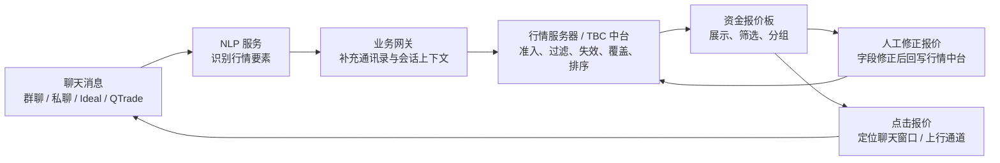

# 资金 / 现券复用组件 - 报价板数据流设计

> 日期: 2026-05-19  
> 范围: 资金业务报价板面、现券聊天组件复用、NLP 行情解析、业务网关补全、行情服务器 / TBC 中台准入与筛选  
> 状态: 讨论稿，供产品、业务、NLP、网关、行情中台、前端联调使用

---

## 1. 背景与目标

资金业务希望复用现券侧已经沉淀的聊天、报价修正、行情面板和点击报价联动能力，形成从聊天消息到资金报价板的实时数据通路。

本需求的核心不是简单展示聊天解析结果，而是要把聊天原文转换成可准入、可失效、可筛选、可排序、可追溯、可人工修正的资金行情。

目标包括:

- NLP 服务从聊天原文中识别资金业务相关行情要素。
- 业务网关补充发送人、机构、通讯录、会话、渠道等上下文。
- 行情服务器 / TBC 中台统一执行行情准入、过滤、失效、覆盖和最优 / 次优排序。
- 前端报价板支持展示、筛选、分组、修正报价、点击报价唤起聊天。
- 复用现券侧成熟交互，但资金业务保留自己的字段、规则和生命周期。

---

## 2. 总体链路



### 2.1 分层职责

| 层级 | 职责 | 关键输出 |
| --- | --- | --- |
| NLP 服务 | 从原文识别方向、期限、金额、利率、限户、押券、失效语义等 | 结构化解析结果、置信度、原文片段 |
| 业务网关 | 补充发送人、机构映射、通讯录、会话 ID、消息来源 | sender、institution、conversationId、channel |
| 行情中台 | 准入、黑名单、失效、覆盖、过滤、排序、最优 / 次优计算 | 可展示行情、状态、排序结果 |
| 前端报价板 | 展示、筛选、分组、修正、跳转聊天 | 用户可操作工作台 |
| 聊天组件 | 复用现券聊天弹窗、原文定位、上行能力 | 会话定位和沟通闭环 |

---

## 3. 数据流明细

### 3.1 NLP 识别

NLP 需要输出资金行情字段，同时保留原文和解析依据。建议每条解析结果都带置信度，低置信度字段允许进入人工修正流程，但不直接参与自动最优排序。

建议字段:

| 字段 | 说明 | 示例 | 备注 |
| --- | --- | --- | --- |
| direction | 方向 | 融入 / 融出 / 正回购 / 逆回购 | 需统一枚举 |
| tenor | 期限 | 隔夜 / 7D / 14D / 21D / 28D | 资金业务默认不做 1M 以上业务 |
| amount | 金额 | 5e / 10e | 支持总量、单笔下限拆分 |
| minAmount | 单笔不少于 | 单笔不少于 1e | 从“总量 xxx，单笔不少于 xxx”中解析 |
| rate | 利率 | 1.85 | 可支持区间 |
| rateRange | 利率区间 | 1.80-1.90 | 用于筛选与异常判断 |
| accountRequirement | 限户要求 | 限银行 / 限非银 / 不限 | 建议枚举 + 原文兜底 |
| collateralRequirement | 押券要求 | 利率债 / 存单商金 / 信用 | 建议枚举 + 原文兜底 |
| collateralTolerance | 押券容忍度 | 可商量 / 严格 / 不接受 | 用于筛选和排序权重 |
| businessCategory | 业务分类 | 利率地方 / 存单商金 / 信用 | 可由押券要求派生 |
| expireSignal | 失效语义 | 出完 / 收工 / 撤 | 触发行情失效 |
| quoteStatus | 初始状态 | active / filled / expired / pending_review | 中台最终裁决 |
| confidence | 字段置信度 | 0.92 | 字段级或整句级 |
| rawText | 原文 | 原始聊天消息 | 前端悬浮展示 |

### 3.2 业务网关补充

业务网关负责把 NLP 只知道的“消息”补全为可交易的“行情上下文”。

需要补充:

- 发送人 ID、姓名、所属机构。
- 发送人和机构的稳定映射关系。
- 机构标准名称、机构别名、机构类型。
- 聊天会话 ID、消息 ID、消息时间、消息来源渠道。
- 是否来自大群、私聊、Ideal、QTrade 或其他接入通道。
- 可打开聊天窗口的 deeplink 或组件定位参数。
- 发送人是否在通讯录、是否能上行、是否可被当前用户触达。

需要注意:

- 大群消息解析通路相对清晰。
- 私聊消息如果要进入行情，可能需要进一步开放消息准入范围，并明确隐私与权限边界。
- 发送人到机构的映射不能只依赖展示名，建议使用通讯录 ID + 机构主数据 + 别名表。

### 3.3 行情服务器 / TBC 中台处理

中台负责把解析结果转为可展示行情，并维护行情生命周期。

处理顺序建议:

1. 标准化: 字段枚举归一、期限归一、金额单位归一、机构归一。
2. 准入: 判断对手库、黑名单、账户类型、消息来源、业务范围。
3. 业务过滤: 判断方向、期限、金额、利率、押券、限户等是否满足规则。
4. 生命周期处理: 判断是否新增、覆盖、失效、出完、过期、偏离异常。
5. 排序计算: 计算最优 / 次优，加入对手优劣等级、新鲜度等权重。
6. 输出前端: 返回可展示行情、不可展示原因、原文、修正入口所需字段。

---

## 4. 有效报价过滤规则

有效报价应由中台统一裁决，前端只做展示和用户筛选，不应自行决定一条行情是否有效。

### 4.1 硬性准入

| 规则 | 处理方式 | 说明 |
| --- | --- | --- |
| 对手库准入 | 不在库默认不可展示或进入待审核 | 需支持“仅库内 / 全部 / 待审核”策略 |
| 黑名单 | 直接过滤 | 不进入最优 / 次优 |
| 业务方向 | 非资金方向过滤 | 防止误把现券、存单、闲聊入板 |
| 期限范围 | 1M 以上过滤 | 当前讨论为资金业务不做 1M 以上 |
| 失效状态 | expired / filled 不参与有效报价 | 可在历史或全部视图查看 |
| 权限范围 | 当前用户不可见则过滤 | 尤其是私聊消息 |

### 4.2 可筛选条件

以下条件既可以参与默认过滤，也应该作为报价板筛选项:

- 对手机构。
- 账户类型 / 限户要求。
- 押券要求。
- 押券容忍度。
- 方向。
- 期限。
- 金额区间。
- 利率区间。
- 更新时间 / 新鲜度。
- 报价状态。
- 消息来源渠道。

### 4.3 异常报价处理

明显偏离中位数的报价不建议直接删除，建议进入 `pending_review` 或标记为 `outlier`:

- 不进入默认最优 / 次优。
- 可在“异常 / 待确认”视图中查看。
- 支持人工确认后恢复为 active。
- 需要记录异常原因，例如“偏离同期限中位数 20bp”。

---

## 5. 失效与覆盖机制

失效机制需要比普通行情展示更严格，因为资金报价时效短，且“最优 / 次优”对交易动作影响大。

### 5.1 失效来源

| 来源 | 规则 | 状态 |
| --- | --- | --- |
| 超时失效 | 不同时段配置不同过期时间 | expired |
| 明确出完 | 解析到“出完”“收工”“没了”等 | filled |
| 同期限新报价 | 同机构、同方向、同期限新报价覆盖旧报价 | replaced |
| 人工撤销 | 用户手动标记失效 | cancelled |
| 偏离异常 | 明显偏离市场中位数 | pending_review / outlier |

### 5.2 超时配置建议

当前讨论规则:

| 时段 | 建议有效期 | 说明 |
| --- | --- | --- |
| 08:00-09:30 | 10 分钟 | 开盘前后报价变化快 |
| 09:30 之后 | 30 分钟 | 盘中相对稳定 |

需要支持配置化:

- 按业务方向配置。
- 按期限配置。
- 按机构等级配置。
- 按消息来源配置。
- 按人工修正报价配置单独有效期。

### 5.3 覆盖规则

建议默认覆盖键:

```text
institutionId + direction + tenor + accountRequirement + collateralRequirement
```

同一个覆盖键下出现新报价:

- 新报价为 active。
- 旧报价置为 replaced。
- 前端默认只展示最新 active。
- 历史视图保留旧报价和覆盖关系。

如果新报价字段缺失较多或置信度较低，不应直接覆盖，应进入待确认。

---

## 6. 行情面板展示、筛选与分组

### 6.1 展示字段

| 字段 | 展示 | 筛选 / 分组 | 说明 |
| --- | --- | --- | --- |
| 业务分类 | 支持 | 支持分组 | 主要按押券要求派生: 利率地方 / 存单商金 / 信用 |
| 机构名称 | 支持 | 支持筛选 | 业务网关维护发送人-机构映射 |
| 金额 | 支持 | 支持区间筛选 | 总量和单笔下限需要分开展示 |
| 利率 | 支持 | 支持区间筛选 | 排序核心字段 |
| 期限 | 支持 | 支持筛选 | 不做 1M 以上业务 |
| 方向 | 支持 | 支持筛选 | 融入 / 融出或正 / 逆回购需统一 |
| 限户要求 | 支持 | 支持筛选 | 建议枚举化，原文兜底 |
| 押券要求 | 支持 | 支持筛选 / 分组 | 建议枚举化，原文兜底 |
| 更新时间 | 支持 | 支持筛选 | 与失效机制强相关 |
| 原文 | 支持 | 不建议作为筛选 | 空间不足时悬浮展示 |
| 状态 | 支持 | 支持筛选 | active / stale / filled / expired / replaced |
| 来源 | 支持 | 支持筛选 | 群聊 / 私聊 / Ideal / QTrade |

### 6.2 业务分类补充

当前三类:

1. 利率地方。
2. 存单商金。
3. 信用。

需要补充两个兜底分类:

- 无要求: 原文没有明确账户或押券要求。
- 复合要求: 同时包含多个条件，例如“利率或存单都可”“非银不限券”。

如果解析不出对应账户要求:

- 不要强行归入三类之一。
- `accountRequirement = unknown`，`businessCategory = unclassified`。
- 前端显示“未识别”，允许人工修正。
- 不进入需要严格分类的默认最优分组，或按配置进入“未分类”分组。

如果超出三类范围:

- 保留原文要求。
- 进入“其他 / 复合”分类。
- 后续通过历史 NLP 词云和人工修正记录迭代枚举。

### 6.3 金额展示补充

“总量 xxx，单笔不少于 xxx”建议拆成两个字段:

| 字段 | 示例 | 展示建议 |
| --- | --- | --- |
| totalAmount | 总量 10e | 主金额列展示 |
| minAmount | 单笔不少于 1e | 金额列副信息或 tooltip |

展示示例:

```text
10e
单笔 >= 1e
```

筛选时:

- 金额区间默认筛 `totalAmount`。
- 如果用户启用“单笔门槛”，再筛 `minAmount`。

---

## 7. 最优 / 次优排序

最优 / 次优绝大多数时候利率相同，因此排序不能只看价格，需要加入对手质量、新鲜度和业务偏好。

### 7.1 排序因子

| 优先级 | 因子 | 说明 |
| --- | --- | --- |
| 1 | 利率 | 方向决定升序或降序 |
| 2 | 报价状态 | active 优先，stale 降权，异常不参与 |
| 3 | 对手等级 | 核心对手、近半年交易量、外汇交易中心优秀机构等 |
| 4 | 新鲜度 | 更新时间越近越优 |
| 5 | 金额可成交性 | 金额更匹配需求者优先 |
| 6 | 押券 / 限户匹配度 | 与当前筛选或策略越匹配越优 |
| 7 | 原始顺序 | 兜底稳定排序 |

### 7.2 对手等级数据来源

可使用:

- 泰康对手库。
- 核心对手标识。
- 近半年交易量。
- 外汇交易中心优秀机构等外部或内部标签。
- 历史成交成功率、履约情况。

算法需要在测试环境或实际运行中持续调参。建议先支持规则配置，再沉淀打分模型。

---

## 8. 操作逻辑

### 8.1 修正报价

前端支持点击报价进入修正弹窗，弹窗需要展示:

- 原文。
- NLP 解析字段。
- 字段置信度。
- 当前中台状态。
- 机构与发送人信息。
- 可编辑字段: 限户要求、押券要求、金额、利率、期限、方向、状态等。

修正保存后:

1. 前端提交修正后的结构化行情。
2. 中台重新执行准入、失效、覆盖和排序。
3. 主站重新计算最优 / 次优。
4. 修正记录进入审计日志，可反哺 NLP 迭代。

### 8.2 点击报价

点击报价支持弹窗或侧边窗口:

- 定位对应行情发送人的聊天页面。
- 展示原文和解析字段。
- 支持 Ideal / QTrade 通道。
- 支持上行消息。
- 支持一键带入询价上下文，例如机构、期限、金额、利率、押券要求。

建议点击报价后的默认动作不是直接发送，而是打开聊天并预填上下文，最终发送由交易员确认。

---

## 9. 现券组件复用边界

### 9.1 可复用

- 聊天弹窗容器。
- 原文展示与消息定位。
- 报价修正弹窗框架。
- 行情表格基础组件。
- 筛选条、分组、排序、状态标签。
- 点击报价打开聊天的链路。
- Ideal / QTrade 上行通道适配能力。

### 9.2 需要资金业务定制

- NLP 字段集合。
- 方向、期限、金额、利率、限户、押券枚举。
- 失效和覆盖规则。
- 1M 以上期限过滤。
- 对手库准入和对手等级排序。
- 最优 / 次优计算逻辑。
- 资金报价板展示密度和分组方式。

### 9.3 不建议前端复用的部分

- 现券的债券字段模型。
- 现券的报价有效性判断。
- 现券的最优报价排序规则。
- 现券的生命周期状态直接枚举，如果语义不同应重新定义。

---

## 10. NLP 迭代策略

账户要求和押券要求业务复杂，不建议一次性把所有口径做死。

建议路线:

1. 先定义基础枚举和 unknown / other / composite 兜底。
2. 运行一段时间，收集脱敏语聊和人工修正记录。
3. 从历史 NLP 结果中生成高频词云和误识别样本。
4. 与业务确认新增枚举、同义词、冲突规则。
5. 通过修正记录反哺模型和规则。

需要沉淀的数据:

- 原文脱敏样本。
- NLP 初始解析。
- 人工修正结果。
- 字段级差异。
- 最终是否成交或是否被采用。
- 误判原因分类。

---

## 11. 待确认问题

| 问题 | 建议 | 待确认方 |
| --- | --- | --- |
| 私聊消息是否进入行情准入 | 需要明确权限和合规边界 | 业务 / 合规 / 网关 |
| 对手库外报价是否展示 | 建议默认不进最优，进入待审核或独立筛选 | 业务 / 风控 |
| 账户要求枚举 | 先给基础枚举，保留 unknown / other | 业务 / NLP |
| 押券要求枚举 | 先给基础枚举，保留复合要求 | 业务 / NLP |
| 超时失效时间 | 先按 08:00-09:30 10min、09:30 后 30min 配置 | 业务 / 中台 |
| 明显偏离中位数阈值 | 建议按期限和方向配置 bp 阈值 | 业务 / 中台 |
| 对手等级算法 | 初期规则打分，后续结合交易量和成交反馈调参 | 业务 / 数据 |
| 点击报价是否自动上行 | 建议只预填，不自动发送 | 产品 / 交易员 |

---

## 12. 分阶段落地建议

### 一期: 可用闭环

- 接入群聊消息。
- NLP 输出基础字段。
- 网关补充发送人和机构。
- 中台完成基础准入、黑名单、期限、状态过滤。
- 前端展示 active 报价，支持基础筛选。
- 支持原文悬浮和报价修正。
- 支持点击报价打开聊天。

### 二期: 质量提升

- 完善失效、覆盖、出完识别。
- 加入对手等级排序。
- 支持异常报价标记。
- 支持账户要求、押券要求多枚举筛选。
- 引入人工修正反哺 NLP。

### 三期: 交易效率增强

- Ideal / QTrade 上行能力。
- 私聊准入与权限闭环。
- 成交反馈回写。
- 对手优劣评分模型。
- 根据历史成交和修正记录优化最优 / 次优策略。

---

## 13. 建议接口字段草案

```ts
type FundQuote = {
  quoteId: string;
  sourceMessageId: string;
  conversationId: string;
  channel: "group" | "private" | "ideal" | "qtrade" | "other";

  senderId: string;
  senderName: string;
  institutionId?: string;
  institutionName?: string;

  direction: "borrow" | "lend" | "repo" | "reverse_repo" | "unknown";
  tenor: "ON" | "7D" | "14D" | "21D" | "28D" | "other";
  totalAmount?: number;
  minAmount?: number;
  rate?: number;
  rateRange?: [number, number];

  accountRequirement: string;
  collateralRequirement: string;
  collateralTolerance?: string;
  businessCategory: "rate_local" | "ncd_commercial" | "credit" | "none" | "composite" | "unclassified";

  status: "active" | "stale" | "expired" | "filled" | "replaced" | "cancelled" | "pending_review";
  invalidReason?: string;
  replacedByQuoteId?: string;

  quotedAt: string;
  updatedAt: string;
  expireAt?: string;

  rawText: string;
  confidence: number;
  fieldConfidence?: Record<string, number>;
};
```

---

## 14. 核心结论

资金报价板可以复用现券组件的“展示、修正、聊天定位、上行通道”能力，但不能复用现券的行情语义和有效性判断。资金业务的关键在于中台规则: 准入、失效、覆盖、筛选、异常识别和复合排序。

短期建议先把链路跑通，并把 unknown / other / pending_review 作为兜底，避免 NLP 早期误识别直接影响最优报价。中期通过脱敏语聊、人工修正和成交反馈持续迭代账户要求、押券要求和对手排序规则。
