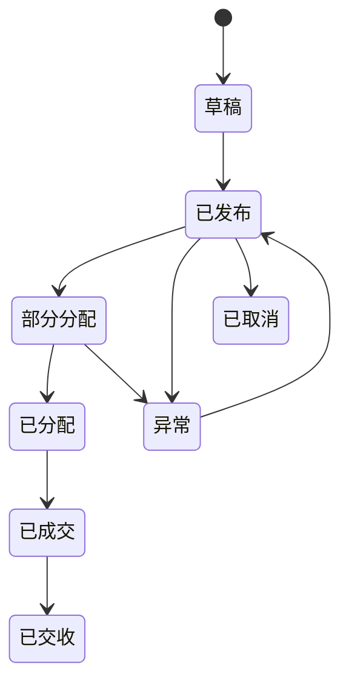
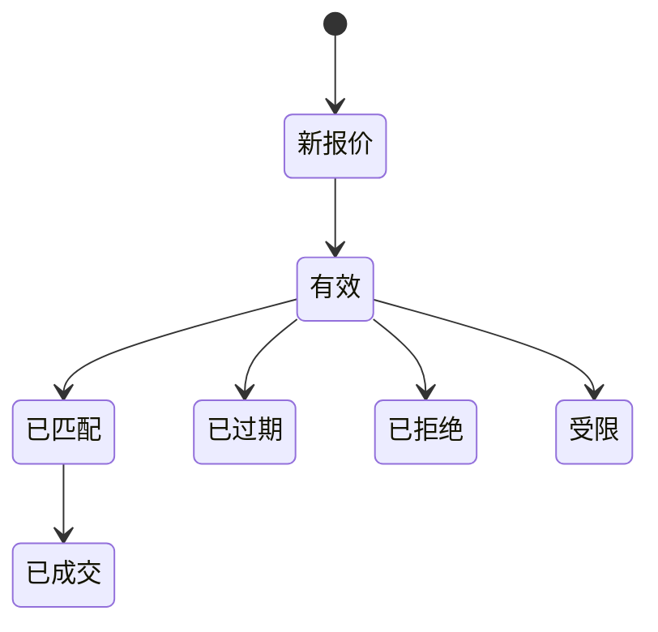
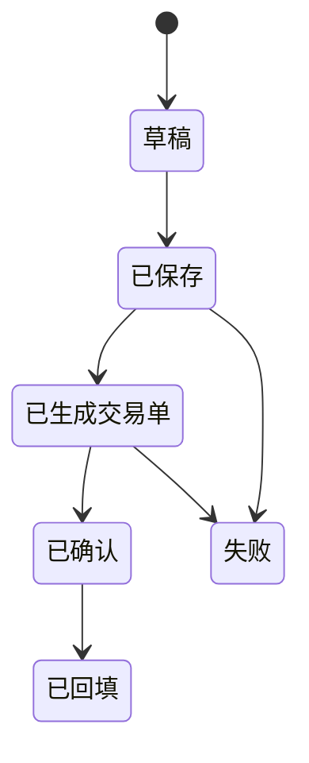

# 资金逆回购交易指令业务说明

## 1. 文档目的

本文用于说明资金逆回购交易指令在工作台中的业务含义、流转过程、页面区域职责和关键处理规则，方便业务人员、产品经理、前端、后端和测试人员统一理解。

本文重点解释截图中的以下区域：

- 询价单
- 交易单
- 询价工作台
- 询价明细
- 分配单
- 交收与回填
- 机器人任务配置

## 2. 业务背景

资金逆回购是我方作为资金出借方，将资金通过回购交易融出给对手方，并取得约定利率收益的业务。

交易员每天会收到多个账户或产品的资金出借需求。每个需求通常包含账户、期限、金额、保本利率、质押要求、账户限制等信息。交易员需要在市场上向多个对手方询价，选择合适报价后成交，并将成交金额分配回具体账户需求。

传统 Excel 工作方式中，交易员需要同时维护需求、报价、成交、分配、校验和回填，容易出现以下问题：

- 报价信息分散在聊天、广播、人工录入和行情表中。
- 一个对手方报价可能拆给多个账户，一个账户需求也可能由多个报价补足。
- 成交后未分配余额需要人工追踪。
- 合规、验券、账户限制、对手方限制等校验容易遗漏。
- 回填指令和交易单状态难以及时同步。

资金逆回购交易工作台的目标，是把上述过程结构化、自动化和可追踪化。

## 3. 业务角色

| 角色 | 职责 |
| --- | --- |
| 资金交易员 | 发起询价、确认成交、分配成交、处理异常 |
| 机器人 / AI 助手 | 自动询价、解析报价、推荐分配、提示异常 |
| 中台 / 合规系统 | 校验账户、质押券、对手方限制和交易合规性 |
| 交收系统 | 接收交易单，完成成交确认、交收和回填 |
| 产品 / 账户经理 | 提供账户需求、保本要求和业务限制 |

## 4. 核心业务对象

### 4.1 交易指令

交易指令是账户或产品发出的资金出借需求，是整个流程的起点。

一条交易指令通常包含：

- 账户编号
- 账户简称
- 期限
- 指令金额
- 已出金额
- 未出金额
- 完成度
- 保本金额
- 保本利率
- 账户限制
- 质押要求
- 交易员

截图左上方“交易单”区域展示的就是交易指令明细。

### 4.2 询价需求

询价需求是交易员基于交易指令，向市场或指定对手方发出的询价请求。

询价需求可以来自：

- 新增需求
- 广播
- 自动询价
- 人工录入
- 聊天窗口追问

一个交易指令可以生成多个询价需求。

### 4.3 对手方报价

对手方报价是机构或交易员反馈的可成交条件。

报价通常包含：

- 对手方名称
- 对手方交易员
- 期限
- 金额
- 利率
- 有效时间
- 账户限制
- 质押要求
- 备注

截图右下方“询价明细”区域展示的是逐条报价。

截图右上方黄色矩阵是报价汇总视图，用来快速比较不同对手方在不同账户需求上的可用报价。

### 4.4 成交分配

成交分配是把某一笔报价或成交金额分配到具体账户交易指令上。

例如：

- 对手方 A 报价 5 亿。
- 账户 1 需要 2 亿。
- 账户 2 需要 3 亿。
- 系统可以把这笔报价拆分成两条分配记录。

截图左下方“分配单 / 报价单”区域展示的是分配结果和交易单生成前的校验状态。

### 4.5 交易单

交易单是成交分配确认后形成的正式交易记录，用于传递给后续交易、风控、合规或交收系统。

交易单通常包含：

- 我方账户
- 对手方
- 对手交易员
- 金额
- 利率
- 期限
- 交易时间
- 合规状态
- 验券状态
- 人工确认状态
- 回填状态

### 4.6 交收回填

交收回填是交易完成后，把外部系统的成交编号、交收结果、失败原因或回填指令同步回工作台。

回填信息用于确认：

- 交易是否成功提交
- 是否完成交收
- 是否需要人工补录
- 是否存在失败或退回

## 5. 业务主流程

### 5.1 导入或生成交易指令

交易员进入工作台后，系统展示当日资金逆回购交易指令。

系统按账户和期限统计：

- 总指令金额
- 已成交金额
- 未成交金额
- 完成度
- 保本利率
- 未出金额

交易员可以根据未出金额、完成度和保本利率判断当前最需要优先处理的账户。

### 5.2 发起询价

交易员可以选择一个或多个交易指令发起询价。

询价方式包括：

- 指定对手方询价
- 广播询价
- 自动询价
- 从聊天报价中反向生成询价记录

系统需要记录询价来源，避免后续报价和成交无法追溯。

### 5.3 接收和整理报价

对手方报价进入系统后，系统按照期限、金额、利率、账户限制和质押要求进行结构化。

报价可能来自：

- 人工录入
- 聊天解析
- 广播回复
- 外部行情系统
- Excel 导入

系统应当标记报价是否有效，并识别以下情况：

- 期限缺失
- 金额缺失
- 利率缺失
- 账户限制不明确
- 质押要求不明确
- 报价已过期
- 对手方限制
- 不符合保本要求

### 5.4 报价匹配交易指令

系统根据以下条件进行匹配：

- 期限一致
- 金额可覆盖
- 利率不低于账户保本利率
- 对手方符合准入要求
- 账户限制符合要求
- 质押要求符合要求
- 交易员权限符合要求

匹配结果展示在报价矩阵中。矩阵不是主数据，而是辅助交易员快速判断可成交组合的视图。

### 5.5 成交确认

交易员选择报价后进行成交确认。

成交确认时需要明确：

- 使用哪条报价
- 成交金额
- 成交利率
- 成交期限
- 对手方
- 对手交易员
- 分配到账户的金额

如果成交金额未完全分配，剩余部分应进入“待分配余额”。

### 5.6 成交分配

系统支持以下分配方式：

- 自动分配
- 人工分配
- 先成交后待分配
- 从待分配池再次分配

自动分配应优先考虑：

- 未出金额大的账户
- 保本利率更高的账户
- 期限完全匹配的账户
- 账户限制和质押要求满足的账户
- 不超过账户剩余未出金额

### 5.7 校验与生成交易单

分配保存后，系统对每条分配进行校验：

- 金额校验
- 账户校验
- 对手方限制校验
- 质押券校验
- 合规校验
- 人工确认校验

校验通过后生成交易单。

### 5.8 交收与回填

交易单进入后续交易或交收系统。

回填状态包括：

- 待回填
- 已提交
- 成功
- 失败
- 需人工处理

失败时应展示失败原因和建议动作。

## 6. 页面区域说明

### 6.1 询价单

用于展示当前询价和交易进度的汇总信息。

主要字段：

- 总额
- 已出
- 未出
- 金额单位
- 我的口径

业务用途：

- 快速判断当天资金逆回购任务完成情况。
- 判断是否仍需继续询价。
- 判断是否存在未出缺口。

### 6.2 交易单

用于展示账户级资金出借需求。

主要字段：

- 选择
- 锁定状态
- 账户
- 账户简称
- 期限
- 指令金额
- 已出金额
- 未出金额
- 完成度
- 保本金额
- 保本利率
- 交易员

业务用途：

- 作为分配和成交的目标账户池。
- 作为询价需求的来源。
- 作为成交回写的统计依据。

### 6.3 询价工作台

用于集中处理询价、报价、报价矩阵和成交候选。

主要字段：

- 指令
- 账户
- 账户简称
- 期限
- 备注
- 新增需求
- 广播
- 保存分配
- 对手方报价矩阵

业务用途：

- 汇总可用报价。
- 展示每个对手方在每个账户需求上的报价。
- 标记限制、异常和推荐结果。
- 支持交易员快速选择成交组合。

### 6.4 询价明细

用于展示逐条报价。

主要字段：

- 对手名称
- 对手交易员
- 金额
- 价格
- 期限
- 备注
- 时间
- 有效

业务用途：

- 保存报价原始记录。
- 支持报价追溯。
- 作为成交分配的数据来源。

### 6.5 分配单 / 报价单

用于展示成交分配和生成交易单前的检查结果。

主要字段：

- 账户
- 账户简称
- 对手
- 对手交易员
- 金额
- 价格
- 期限
- 验券
- 合规
- 分配单
- 人工确认
- 回填指令

业务用途：

- 确认成交金额如何分配到账户。
- 显示交易单是否具备提交条件。
- 暴露金额不足、对手限制、回填失败等问题。

### 6.6 机器人任务配置

用于配置自动化处理动作。

可配置任务包括：

- 自动询价
- 自动发布需求
- 自动处理报价信息
- 自动沟通
- 自动对券
- 自动确认

业务用途：

- 减少人工重复操作。
- 在交易员确认前自动准备报价和分配建议。
- 对异常情况进行提醒，而不是直接强制成交。

## 7. 关键业务规则

### 7.1 金额规则

1. 成交分配金额不能超过交易指令未出金额。
2. 成交分配金额不能超过报价可用金额。
3. 一笔报价可以拆分给多个账户。
4. 一个账户可以由多笔报价补足。
5. 成交后未分配金额必须进入待分配池。

### 7.2 利率规则

1. 报价利率原则上应不低于账户保本利率。
2. 低于保本利率的报价应标红或拦截。
3. 可允许人工覆盖，但必须记录原因。

### 7.3 期限规则

1. 报价期限必须与交易指令期限匹配。
2. 可支持业务规则下的期限替代，但必须显式提示。
3. 期限缺失的报价不能自动成交。

### 7.4 账户限制规则

1. 报价若限制“专户 / 公募 / 自营 / 资管”等账户类型，只能分配给符合条件的账户。
2. 对手方如果对账户有限制，需要在报价矩阵中提示。
3. 账户限制不明确时，应要求人工确认。

### 7.5 质押要求规则

1. 质押券要求必须与账户或交易需求兼容。
2. 验券未通过时，不允许直接生成正式交易单。
3. 可先保存草稿，但需要标记异常。

### 7.6 有效性规则

1. 报价超过有效时间后应自动置为过期。
2. 无效报价不能进入自动分配。
3. 过期报价可保留历史，但不能作为成交依据。

### 7.7 人工确认规则

以下情况必须人工确认：

- 低于保本利率
- 账户限制不明确
- 质押券校验未通过
- 对手方限制
- 金额不匹配
- 期限不完全匹配
- 机器人自动分配结果

## 8. 状态流转

### 8.1 交易指令状态

### 8.2 报价状态

### 8.3 分配状态

## 9. 异常场景

| 异常 | 说明 | 建议处理 |
| --- | --- | --- |
| 报价缺少金额 | 只识别到利率或期限 | 标记为信息不完整，提示追问 |
| 报价缺少期限 | 无法匹配账户需求 | 不允许自动成交 |
| 报价低于保本 | 收益不满足账户要求 | 标红并要求人工确认 |
| 账户限制不匹配 | 如报价仅限公募，但账户为自营 | 禁止自动分配 |
| 质押券不匹配 | 对手方质押要求与账户规则不一致 | 进入验券异常 |
| 成交金额超额 | 分配金额超过账户未出或报价金额 | 阻止保存 |
| 成交后未分配 | 成交金额未全部分配到账户 | 自动进入待分配余额 |
| 回填失败 | 外部系统未接受交易单 | 展示失败原因，支持重试或人工回填 |

## 10. 建议产品能力

### 10.1 必备能力

- 账户交易指令列表
- 报价明细列表
- 对手方报价矩阵
- 快捷分配
- 待分配余额池
- 校验状态展示
- 交易单生成
- 回填状态跟踪

### 10.2 增强能力

- AI 自动解析聊天报价
- AI 推荐分配方案
- 自动询价
- 自动广播需求
- 自动识别限制条件
- 自动提示保本价风险
- 自动聚合同一对手方同一期限报价

### 10.3 风控能力

- 低于保本拦截
- 账户限制校验
- 对手方准入校验
- 质押券校验
- 金额超额校验
- 人工确认留痕
- 操作日志追踪

## 11. 与数据结构文档的关系

本文是业务说明文档，面向业务理解和产品沟通。

配套的数据结构文档为：

- `资金逆回购交易指令数据结构.md`

数据结构文档用于研发落地，本文用于解释为什么需要这些对象和字段。

