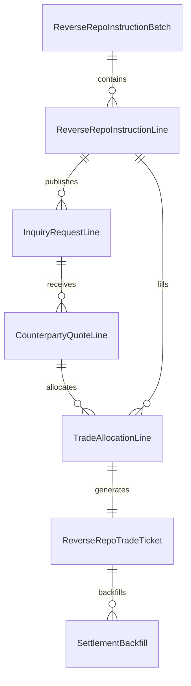

# 资金逆回购交易指令数据结构

> 范围：资金逆回购交易工作台。覆盖截图中的“询价单 / 交易单 / 询价工作台 / 询价明细 / 分配单 / 交收回填”。

## 一、设计原则

1. 金额统一使用 `amountWan`，单位为“万”。前端展示“亿”时除以 `10000`。
2. 交易主线按“需求指令 -> 询价报价 -> 成交分配 -> 交易单 -> 交收回填”拆分。
3. 一个账户需求可以被多个对手方报价拆分成交；一个报价也可以分配给多个账户需求。
4. 期限统一用 `tenor`，同时保留 `termDays` 便于排序、校验和规则计算。
5. 黄色表格中的“对手方报价矩阵”不作为主数据保存，只是由 `quoteLines` 和 `allocations` 派生出来。

## 二、核心对象关系



## 三、TypeScript 结构建议

```ts
export type MoneyWan = number;
export type RatePct = number;

export type ReverseRepoTenor = 'R001' | 'R007' | 'R014' | 'R021' | 'R028' | string;

export type InstructionStatus =
  | 'draft'
  | 'published'
  | 'partiallyAllocated'
  | 'allocated'
  | 'traded'
  | 'settled'
  | 'cancelled'
  | 'exception';

export type QuoteStatus = 'new' | 'valid' | 'expired' | 'matched' | 'rejected' | 'limited';

export type AllocationStatus =
  | 'draft'
  | 'saved'
  | 'sentToTrade'
  | 'confirmed'
  | 'backfilled'
  | 'failed';

export type CheckStatus = 'pending' | 'passed' | 'failed' | 'warning' | 'ignored';

export interface ReverseRepoInstructionBatch {
  batchId: string;
  tradeDate: string;
  direction: 'reverseRepo';
  currency: 'CNY';
  amountUnit: 'WAN';
  sourceSheet?: string;
  operator: string;
  status: InstructionStatus;
  summary: {
    instructionAmountWan: MoneyWan;
    tradedAmountWan: MoneyWan;
    untradedAmountWan: MoneyWan;
    allocatedAmountWan: MoneyWan;
    pendingAllocationAmountWan: MoneyWan;
  };
  lines: ReverseRepoInstructionLine[];
}

export interface ReverseRepoInstructionLine {
  lineId: string;
  instructionNo?: string;
  rowNo?: number;

  account: {
    accountId: string;
    accountCode: string;
    accountName: string;
    accountShortName: string;
    accountType?: string;
    productType?: string;
  };

  tenor: ReverseRepoTenor;
  termDays: number;

  amount: {
    instructionAmountWan: MoneyWan;
    tradedAmountWan: MoneyWan;
    untradedAmountWan: MoneyWan;
    allocatedAmountWan: MoneyWan;
    pendingAmountWan: MoneyWan;
    completionRate: number;
  };

  pricing: {
    breakevenAmountWan?: MoneyWan;
    breakevenRate?: RatePct;
    targetRate?: RatePct;
  };

  constraints: {
    accountLimit?: string;
    collateralRequirement?: string;
    counterpartyLimit?: string;
    canKeepCashIdle?: boolean;
    notes?: string;
  };

  owner: {
    traderId?: string;
    traderName: string;
  };

  uiState?: {
    selected?: boolean;
    locked?: boolean;
    hiddenWhenDone?: boolean;
    warningText?: string;
  };

  status: InstructionStatus;
}

export interface InquiryRequestLine {
  requestId: string;
  batchId: string;
  instructionLineId: string;
  requestType: 'newDemand' | 'broadcast' | 'manualInquiry' | 'autoInquiry';
  tenor: ReverseRepoTenor;
  termDays: number;
  amountWan: MoneyWan;
  preferredRate?: RatePct;
  accountShortName: string;
  accountLimit?: string;
  collateralRequirement?: string;
  remark?: string;
  sentAt?: string;
  channels: Array<'im' | 'qtrade' | 'manual' | 'broadcast'>;
  status: 'draft' | 'sent' | 'replied' | 'closed' | 'failed';
}

export interface CounterpartyQuoteLine {
  quoteId: string;
  requestId?: string;
  source: 'manual' | 'chatParsed' | 'broadcastReply' | 'qtrade' | 'imported';
  counterparty: {
    institutionId?: string;
    institutionName: string;
    traderId?: string;
    traderName?: string;
  };
  tenor: ReverseRepoTenor;
  termDays: number;
  amountWan: MoneyWan;
  rate: RatePct;
  validUntil?: string;
  quoteTime: string;
  accountLimit?: string;
  collateralRequirement?: string;
  remark?: string;
  isValid: boolean;
  status: QuoteStatus;
}

export interface TradeAllocationLine {
  allocationId: string;
  batchId: string;
  instructionLineId: string;
  quoteId: string;
  accountId: string;
  counterpartyInstitutionId?: string;
  tenor: ReverseRepoTenor;
  termDays: number;
  allocatedAmountWan: MoneyWan;
  rate: RatePct;
  differenceAmountWan?: MoneyWan;
  status: AllocationStatus;
  checks: {
    accountCompliance: CheckStatus;
    collateralCompliance: CheckStatus;
    counterpartyLimit: CheckStatus;
    amountEnough: CheckStatus;
    manualConfirm: CheckStatus;
  };
  createdBy: 'manual' | 'autoAllocation';
  createdAt: string;
}

export interface ReverseRepoTradeTicket {
  ticketId: string;
  batchId: string;
  allocationId: string;
  instructionLineId: string;
  accountCode: string;
  accountName: string;
  counterpartyName: string;
  counterpartyTraderName?: string;
  amountWan: MoneyWan;
  rate: RatePct;
  tenor: ReverseRepoTenor;
  termDays: number;
  tradeTime?: string;
  validUntil?: string;
  sendAccountStatus: CheckStatus;
  complianceStatus: CheckStatus;
  voucherCheckStatus?: CheckStatus;
  manualConfirmStatus: CheckStatus;
  status: 'draft' | 'ready' | 'sent' | 'confirmed' | 'rejected' | 'done';
}

export interface SettlementBackfill {
  backfillId: string;
  ticketId: string;
  instructionNo?: string;
  externalTradeNo?: string;
  settlementStatus: 'pending' | 'submitted' | 'success' | 'failed';
  backfillInstruction?: string;
  feedbackMessage?: string;
  updatedAt: string;
}
```

## 四、截图字段映射

| 截图区域 | Excel 字段 | 建议归属 |
| --- | --- | --- |
| 询价单 / 交易单 | 总额、已出、未出 | `ReverseRepoInstructionBatch.summary` |
| 交易单明细 | 账户、账户简称、期限、指令金额、已出金额、未出金额、完成度 | `ReverseRepoInstructionLine.account / tenor / amount` |
| 交易单明细 | 保本金额、保本利率、交易员 | `ReverseRepoInstructionLine.pricing / owner` |
| 询价工作台 | 指令、账户、账户简称、期限、备注-保存、新增需求、广播 | `InquiryRequestLine` |
| 询价工作台黄色矩阵 | 对手方机构列、报价/金额、限制备注 | `CounterpartyQuoteLine` 派生矩阵 |
| 询价明细 | 对手名称、对手交易员、金额、价格、期限、备注、时间、有效 | `CounterpartyQuoteLine` |
| 分配单 / 报价单 | 账户、账户简称、对手、对手交易员、金额、价格、期限 | `TradeAllocationLine` + `ReverseRepoTradeTicket` |
| 分配单 / 报价单 | 验券、合规、分配单、人工确认、回填指令 | `TradeAllocationLine.checks` + `SettlementBackfill` |
| 机器人任务配置 | 自动询价、自动发布需求、自动处理报价信息、自动沟通、自动对券、自动确认 | 建议单独建 `AutomationTaskConfig` |

## 五、当前原型字段对齐

| 当前原型类型 | 建议目标类型 | 说明 |
| --- | --- | --- |
| `AccountRow` | `ReverseRepoInstructionLine` | 账户需求/交易指令行 |
| `MarketQuote` | `CounterpartyQuoteLine` | 行情/报价候选 |
| `ChatThread` | `CounterpartyQuoteLine.source = chatParsed` | IM 解析出的报价 |
| `DealColumn` | `ReverseRepoTradeTicket` 或成交批次 | 当前矩阵里的成交列 |
| `AllocationCell` | `TradeAllocationLine` | 账户需求与成交/报价的分配关系 |
| `PendingAllocation` | 未分配成交余额 | 成交后尚未落到账户需求的池子 |

## 六、最小落库表

1. `reverse_repo_instruction_batches`
2. `reverse_repo_instruction_lines`
3. `reverse_repo_inquiry_requests`
4. `reverse_repo_quote_lines`
5. `reverse_repo_allocations`
6. `reverse_repo_trade_tickets`
7. `reverse_repo_settlement_backfills`
8. `reverse_repo_operation_logs`

